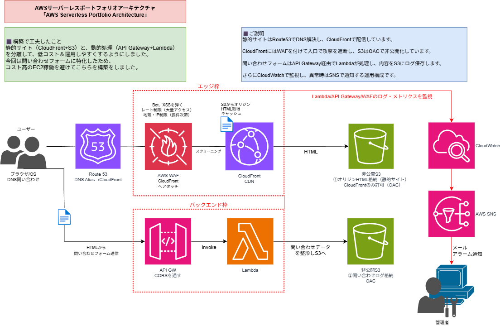

# AWSポートフォリオ（CloudFront + S3 + WAF + Lambda + API Gateway + CDK）

独自ドメインで公開したサーバレスWebサイトと問い合わせフォームをAWS上に構築しました。  
静的配信・セキュリティ・監視・IaC化まで含めて再現可能な形で整理しています。

---

## 🌍 公開サイト

- Webサイト: https://seiyachiba-portfolio.com

---

## 📌 アーキテクチャ概要

### 静的Web配信
- Route53（独自ドメイン管理）
- CloudFront（CDN）
- S3（静的サイト格納）
- OACによりS3を非公開化

### 問い合わせフォーム
- API Gateway（HTTP API）
- Lambda（フォーム処理）
- S3（問い合わせ内容をJSON保存）

### セキュリティ
- AWS WAF（CloudFrontに適用）
- Managed Rules + ログ分析

### 監視
- CloudWatch Logs / Alarm / Dashboard
- SNS通知（portfolio-alerts）

---

## 🛠 使用技術

| 分野 | サービス |
|------|----------|
| 配信 | CloudFront / S3 |
| DNS | Route53 |
| API | API Gateway（HTTP API） |
| 処理 | Lambda |
| 保管 | S3（問い合わせログ） |
| 防御 | AWS WAF |
| 監視 | CloudWatch / SNS |
| IaC | AWS CDK（TypeScript） |

---

## 📂 CDKスタック方針

- CloudFront + WAF（グローバル） → us-east-1  
- Lambda / S3 / API（リージョナル） → ap-northeast-1  

Stack名:

- WafCfLambdaStackUsEast1

---

## ✅ 動作確認

### Web確認

```bash
curl -I https://seiyachiba-portfolio.com
```
### 問い合わせAPI確認（例）

```bash
curl -X POST \
  https://{API_ID}.execute-api.ap-northeast-1.amazonaws.com/prod/contact \
  -H "content-type: application/json" \
  -d '{"name":"test","email":"test@example.com","message":"hello"}'
```

---

## 🧠 学びと工夫（運用視点）

- CloudFront + OAC構成により、S3を完全非公開化しセキュアな静的配信を実現  
- WAFログをCloudWatch Logs Insightsで分析し、不審アクセス傾向を可視化  
- コンソール構築した環境をAWS CDK(TypeScript)でIaC化し再現性を確保  
- API Gatewayの500エラーをCloudWatch Logsで切り分ける運用手順を確立  

---

## 📌 今後の改善予定

- Lambdaエラー原因の修正とテスト整備（APIの安定運用）  
- docs/ に運用手順・障害対応フローを体系的に整理する  

---


---

## 📘 運用ドキュメント

- [運用メモ（Operations）](docs/operations.md)
- [障害対応メモ（Troubleshooting）](docs/troubleshooting.md)

---
