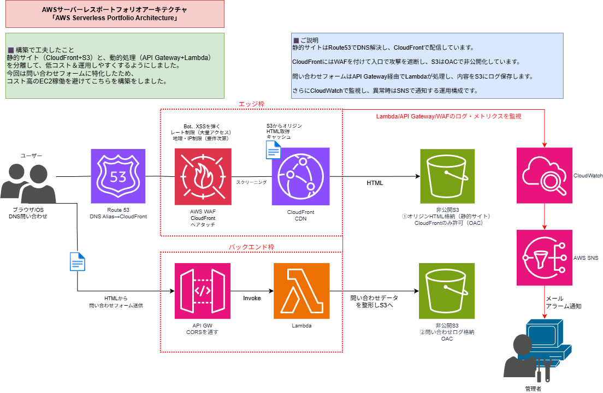

## AWSサーバレスアーキテクチャ　ポートフォリオ  
（CloudFront + S3 + WAF + Lambda + API Gateway + CDK）
---


## 公開サイト

- Webサイト: https://seiyachiba-portfolio.com

---

### 概要  
本ポートフォリオは、AWS上で独自ドメイン付きのサーバレスWebシステムを構築しました。  
インターネット公開基盤における最小構成のセキュアなサーバーレスアーキテクチャを私個人で設計・構築したものです。  

設計思想は以下の4点です：  

・最小権限（Least Privilege）  
・エッジ防御（Edge Security）  
・完全サーバレス化  
・Infrastructure as Code による再現可能な管理  

単なるお問い合わせフォームではなく、  
**実運用を想定したセキュアなWeb公開基盤の設計検証**を目的としています。  

---

## アーキテクチャ思想とデザインの理由  
  
**全体思想**  
  
「インターネット公開基盤を、最小構成でセキュアかつ運用容易に構築する」  

  
**・パブリックエッジ層（CloudFront + WAF）**  
　  
 ■なぜ CloudFront を最前段に置いたか  
　  
　１．DDoS耐性を持たせるため（AWS Shield標準適用）  
　２．エッジでキャッシュを効かせる  
　３．APIへの直接アクセスを遮断する  
　４．TLS終端をエッジで行い、内部を簡潔に保つ  
　👉 “入口で守る” という思想。  
   
  ■なぜ WAF を CloudFront に紐付けたか  
　  
 　１．悪意ある通信をアプリ層に到達させない  
　２．SQLi / XSS / Botアクセスを事前に遮断  
　３．レートベース制限でDoS緩和  
　４．ログを取得し可視化  
　👉 「Lambdaで防ぐ」のではなく  
　👉 「エッジで止める」  

   
**・アプリ層（API Gateway + Lambda）**  
　  
  ■なぜ ALB ではなく API Gateway を採用したか  

 API Gatewayを選択した理由は完全サーバレス化と運用最小化を優先したためです。  
ただし、ALBの方が柔軟なルーティングやコンテナ運用には適しており、  
大規模・常時トラフィック型システムではALBの方が合理的な場合もあります。  
本構成は「低〜中規模の公開基盤」を想定した設計です。  

 　１．完全サーバレス構成を実現  
　➡EC2やコンテナを持たない。つまりはインスタンスほどの管理とコストが不要になる。  
　２．オートスケールを自動化  
  ➡Lambdaはリクエスト単位でスケール。なので、スケール戦略を考えなくてよい。  
　３．運用負荷を最小化  
  ➡OSパッチ不要、サーバ監視不要、Auto Scaling設計不要ということ。  
　４．コスト最適化を優先  
　➡低トラフィック時はほぼゼロコスト。ALBだと常時課金になってしまう。  
　👉 「小さく始める公開基盤」という思想。 
   
   
**・データ層（S3）（OACにより非公開化）**  
　  
  ■なぜ S3 を直接公開しないのか  
　  
    １．直接公開はセキュリティリスク増大  
  ➡WAFを経由しないアクセスをされてしまう。URL直打ちアクセスが可能。  
    　HTTPヘッダーのRefererはcurlで容易に偽装されるため注意する。ログ制御が難しい。  
    　署名付きURLは運用が複雑になる。  
　２．OACによりCloudFront経由のみ許可  
  ➡S3は完全非公開。CloudFrontの署名付きアクセスのみ許可を実現できる。  
　３．バケットポリシーで完全遮断  
　➡aws:SourceArn で制御。　“原則拒否”の思想。  
 👉 「S3はあくまで内部ストレージとして安全性を保つこと」  
  
     
**・監視層（CloudWatch(メトリクス＋アラーム)+ SNS）**  
　  
  ■なぜ監視を最初から設計したか  
  
  本構成では、検知（Detection）→通知（Notification）→調査（Investigation）  
  の流れを明確にしています。  
検知：5××のメトリクス、通知：SNS、調査：CloudWatch Logs  

  　１．本番で一番困るのは“見えない状態”  
　２．ログ後付けは付け忘れたりすることで事故の元に  
　３．500エラー即検知が速やかに修正  
   
**実装思想**  
　　  
  　Lambdaログを常時収集できる  
　　API 5xx をメトリクス化する  
　　WAF BLOCKを可視化する  
　　SNSで自分のメールアドレスへ即時通知  
👉 「障害は起きることを前提として対応できるようにしておくこと」  

    
**・管理層（AWS CDK（TypeScript） / IAM）**  
  
■なぜ IaC を採用したか  
  
１．手動コンソール構築は再現性が乏しい  
２．属人化を避ける  
３．diffで変更点（差分）が可視化できる  
４．再デプロイ可能  

###  ※スタック分割理由  
###   （グローバルスタックus-east-1 / リージョンスタックap-northeast-1）について  

**理由：CloudFrontとWAFはus-east-1依存がある** 

**CloudFrontの特徴**  
CloudFrontは「グローバルサービス」だけど、  
ACM証明書（HTTPS用）は us-east-1で発行が必須。
なのでこちらに紐づくOACもus-east-1で作成が必須。
WAF（CLOUDFRONTスコープ）も us-east-1で作成するもの  
つまり：**CloudFront周りは実質 us-east-1 で管理する必要がある**事を覚えておく。
一方で    
-Lambda  
-API Gateway  
-S3（基本的に）  
-CloudWatch  
は リージョナルスタック (ap-northeast-1（東京）)で作るのが自然。  
だからスタック分割する必要がある。

要するに  
CloudFront関連はus-east-1依存があるため、GlobalStackとして分離しました。  
一方、LambdaやAPI Gatewayなどのアプリケーションリソースは  
東京リージョンに配置し、責務を分離しています。
グローバル・リージョナルではそれぞれ変更頻度も異なるため、  
変更範囲を限定することでリスクが局在化させることでリスクヘッジしています。  
  
### もし東京リージョンが落ちたら？  
現在は単一リージョンなのでこうなります。  
-Cloudfrontは正常  
-オリジン（API/S3）は落ちる  
-サイトは502/504の応答になる  
  
対策設計**マルチリージョン化**    
**①グローバルスタックにOrigin Groupを設定する**  
CloudFrontに、 
-Primary origin：ap-northeast-1  
-Secondary origin：ap-southeast-1（例）
を設定する。  
  
**②S3クロスリージョンレプリケーションを作成**  
-プライマリS3  
-セカンダリS3(自動同期）  
を作成することで整合性を担保  
CloudFrontはリージョン別S3をオリジンに持つ  

③API側の可用性
CloudFrontのOrigin Group機能で、  
-プライマリが5xxになったら  
 セカンダリへフェイルオーバーできる。  

※-DNSフェールオーバーはCloudFrontがエッジで制御するので不要です。  
　-WAFはCloudFrontスコープなので共通で問題ありません。  
  
※CDK設計  
-RegionalStackをパラメータ化  
(同じ設計を、リージョンだけ変えて使えるようにすること。  
つまり：「構成は同じ。でも置く場所を変えられる」ようにすることです。)  
  
```TypeScript  
new RegionalStack(app, 'RegionalStackTokyo', {
  env: { region: 'ap-northeast-1' }
});

new RegionalStack(app, 'RegionalStackSingapore', {
  env: { region: 'ap-southeast-1' }
});
```  
これは同じリージョナルスタックを2回呼び出しています。    
1回目：東京  
2回目：シンガポール  
つまり：同一設計を複数リージョンに展開しています。  
  
※グローバルスタックは各リージョンへの入り口なので、１つのみになります。  

  
■なぜ最小権限を徹底したか  
  
１．過剰権限は漏洩やシステム破壊のリスクになる  
２．IAMは設計力が出る部分  
３．セキュリティはシステムの構成で担保する  
👉 「人を信用せず、設計で守る」  
  
  
## アーキテクチャ概要  
  
ユーザーアクセスはCloudFrontで受け、OAC経由で非公開S3へ配信します。  
問い合わせはAPI Gateway → Lambda → S3に保存され、CloudWatchで監視します。
  


---

## 設計で意識したこと

- CloudFront + OACによりS3を完全非公開化し、静的サイトでもセキュリティを担保
- WAF Managed Rulesを導入し、不審アクセスをCloudWatch Logs Insightsで分析可能にしています。
- API障害時は「入口(API GW)」と「実処理(Lambda)」をログで切り分けられる構成にしています。
- CloudWatch Alarm + SNS通知で運用監視まで含めました。

---

## Repository Structure

- diagrams/ : アーキテクチャ図
- docs/     : 運用・障害対応手順
- infrastructure/ : AWS CDKコード

- CDK code is located here:

infrastructure/waf-cf-lambda-cdk/

---

## 構成要素

### 静的Web配信（フロント）

- Route53（独自ドメイン管理）
- CloudFront（CDN）
- S3（静的サイト格納）
- OACによりS3を完全非公開化

---

### 問い合わせフォーム（バックエンド）

- API Gateway（HTTP API）
- Lambda（問い合わせ処理）
- S3（問い合わせ内容をJSON保存）

---

### セキュリティ

- AWS WAF（CloudFrontに適用）
- Managed Rules + CloudWatch Logs Insights分析

---

### 監視・通知

- CloudWatch Logs / Alarm / Dashboard
- SNS通知（portfolio-alerts）

---

## 🛠 使用技術一覧

| 分野 | サービス |
|------|----------|
| 配信 | CloudFront / S3 |
| DNS | Route53 |
| API | API Gateway（HTTP API） |
| 処理 | Lambda |
| 保管 | S3（問い合わせログ） |
| 防御 | AWS WAF |
| 監視 | CloudWatch / SNS |
| IaC | AWS CDK（TypeScript） |

---

## IaC（AWS CDK）の再現性

本構成はAWS CDK（TypeScript）でIaC化しており、  
CloudShell上で同一環境を再現できます。


CDKコード配置:

infrastructure/waf-cf-lambda-cdk/

---

## デプロイ手順（再現可能）

```bash
cd infrastructure/waf-cf-lambda-cdk
npm install
npm run build
cdk deploy WafCfLambdaStackUsEast1
```

## 動作確認
Web配信確認

```bash
curl -I https://seiyachiba-portfolio.com
```

## 問い合わせAPI確認（例）

```bash
curl -X POST \
  https://{API_ID}.execute-api.ap-northeast-1.amazonaws.com/prod/contact \
  -H "content-type: application/json" \
  -d '{"name":"test","email":"test@example.com","message":"hello"}'
```

---

## 学びと工夫（運用視点）

CloudFront + OAC構成により、S3を完全非公開化しセキュアな配信を実現しました。

WAFログをCloudWatch Logs Insightsで分析し、不審アクセス傾向を可視化しました。

コンソール構築した環境をAWS CDK(TypeScript)でIaC化し再現性を確保しました。

API Gatewayの500エラーをCloudWatch Logsで切り分ける運用手順を確立しました。

---

## トラブルシューティング経験（実務想定）

基礎的なものになりますが、本構成では構築中に実際に以下の障害が発生しました。
なので、１つ１つ原因を切り分けて洗い出し、修正を重ねて知識をつけ対応いたしました。

### ケース：問い合わせAPIが常に500になる

#### 症状
- フロントから送信すると `500 Internal Server Error`
- curlでも同様に500

#### 切り分け
- OPTIONSは204で返っていたためCORSではない
- API Gatewayは入口であり、原因はLambda側例外と判断

#### 対応
- CloudWatch Logsで `START → ERROR → REPORT` を1実行単位で確認
- event入力や環境変数不足を特定し修正

#### 学び
- API障害では「入口(API Gateway)」と「実処理(Lambda)」を分離して考える
- CloudWatch Logsを使った障害切り分けは運用で必須

---

### ケース：CloudFrontでAccessDenied（403）

#### 症状
- ブラウザで `AccessDenied`

#### 原因
- Default root object未設定によりS3側で拒否されていた

#### 対応
- CloudFrontに `index.html` をDefault root objectとして設定し解決

#### 学び
- OAC構成では「S3が公開されないのが正常」
- CloudFront側の設定が入口になる

---

## 今後の拡張ロードマップ（運用改善）

本ポートフォリオは「構築して終わり」ではなく、  
実務運用を想定して継続的に改善できる形を目指しています。

### Phase 1：安定運用（短期）
- Lambda処理の例外ハンドリングを強化する
- API入力バリデーションを追加
- CloudWatch Alarmの閾値調整と通知精度の向上

### Phase 2.1：運用自動化（中期）
- デプロイ前後の自動テストの継続（curl / Lambda unit test）

### Phase 2.2：セキュリティ強化（中期）
- WAF Rate-based rule導入によるDoS対策
- 監査ログ（CloudTrail）との統合
- IAM最小権限ポリシーの継続改善

---

## 運用ドキュメント

この構成は“サービスを作るため”ではなく、“公開基盤を安全に成立させるため”に設計しています。  
運用・障害対応手順は以下に整理しています。

- [運用メモ（Operations）](docs/operations.md)
- [障害対応メモ（Troubleshooting）](docs/troubleshooting.md)
